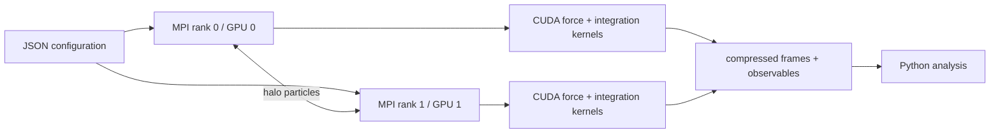

# MD Simulation CUDA

Multi-GPU molecular dynamics simulator for a two-dimensional binary
Lennard-Jones system, implemented in C++17, CUDA, and MPI for Slurm-based HPC
environments.


## What it demonstrates

- Spatial domain decomposition across MPI ranks, with left/right halo exchange
  for short-range interactions.
- Device-resident particle storage and CUDA kernels for force evaluation,
  integration, and energy reduction.
- Velocity-Verlet dynamics with NVE and Nose-Hoover NVT workflows, plus NPH and
  piston experiment drivers.
- Binary-mixture Lennard-Jones parameters, periodic boundaries, restartable
  configurations, and compressed trajectory output.
- Slurm scripts and Python analysis tooling for reproducible cluster studies.



## Build

Requirements:

- CMake 3.18+
- a C++17 compiler
- CUDA Toolkit 12.x and an NVIDIA GPU
- an MPI implementation with CUDA-aware communication for multi-GPU runs
- Python 3 with NumPy development headers
- `vcpkg` dependencies from `vcpkg.json`
- RAPIDS RAFT available to CMake

```bash
git clone https://github.com/Xiaode2333/MD_Simulation_CUDA.git
cd MD_Simulation_CUDA

cmake -S . -B build \
  -DCMAKE_BUILD_TYPE=Release \
  -DCMAKE_TOOLCHAIN_FILE="$VCPKG_ROOT/scripts/buildsystems/vcpkg.cmake" \
  -DCMAKE_CUDA_ARCHITECTURES=80
cmake --build build --parallel
```

Cluster-specific compiler, CUDA, MPI, and Python paths belong in a toolchain
file rather than the project itself. See
[`cmake/cluster-toolchain.example.cmake`](cmake/cluster-toolchain.example.cmake).

## Run

The repository contains small test configurations under `tests/` and formal
experiment drivers under `run/`. For example, after building:

```bash
mpirun -np 1 ./build/run_test_run_test
mpirun -np 4 ./build/run_test_run_test
```

On a Slurm cluster, use the scripts in `scripts/` as site-adaptable examples.
Module names, partitions, GPU constraints, and local toolchain paths vary by
cluster and should be adjusted before submission.

## Verification and benchmarking

Build targets are generated for each source under `tests/`. Start with the
configuration, save/load, MPI-world, and NPH smoke targets appropriate to your
hardware. Multi-GPU validation should compare conserved quantities and saved
frames against a one-rank run with the same initial state.

No benchmark numbers are published yet. To produce a reproducible scaling
table, record the same configuration and seed for 1, 2, and 4 ranks, then report
particle count, steps, GPU model, CUDA/MPI versions, elapsed time, and steps per
second. Do not compare runs that use different numerical settings.

## Repository layout

```text
include/    public simulation interfaces and data structures
src/        C++/CUDA simulation implementation
run/        production experiment drivers
tests/      focused C++/CUDA/MPI test programs and fixtures
scripts/    Slurm submission and analysis orchestration
python/     trajectory analysis and visualization
docs/       scientific notes and figures
external/   bundled GPU Delaunay triangulation dependency
```

## Scope and licensing

This repository is research software. The bundled `gDel2D` source is credited
in `external/gDel2D-Oct2015/README.txt`; it does not include an explicit license
notice in this checkout. A repository-wide open-source license is therefore not
asserted until the dependency's redistribution terms and collaboration
constraints are confirmed.
